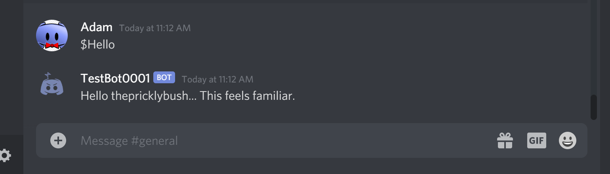
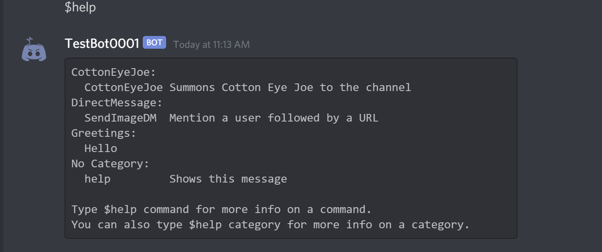

**Purpose**: Create a Discord bot that interacts with members on a Discord server

**Created With**: Python, Discord.py, Google Cloud

**Github**: [Discord Bot](https://github.com/adamlawson99/DiscordBot)

## About
This project came to life when a friend a mine requested that I create a bot for his Discord server with 100+ members. The bot's original task was simply to state jokes when users entered certain key phrases in the text chat channels. The bot’s functionality is slowly being expanded over time with new commands. The bot is built on the Discord.py library, which is the most active Discord API for Python. Without getting into too much detail, the Discord.py library is very easy to use and extensible. Through the use of **cogs** new features can easily be added to the bot and deployed.

The bot is currently being hosted on Google Cloud. Google cloud allows the bot to achieve high availability and uptime at a low cost, as it doesn't require much computing power. It runs through a Debian 10 powered virtual machine supported by the Python virtual environment for easy dependency management.

## Examples
Installation instructions can be found at the Github link above.

### User interaction

### Greetings

### Help

