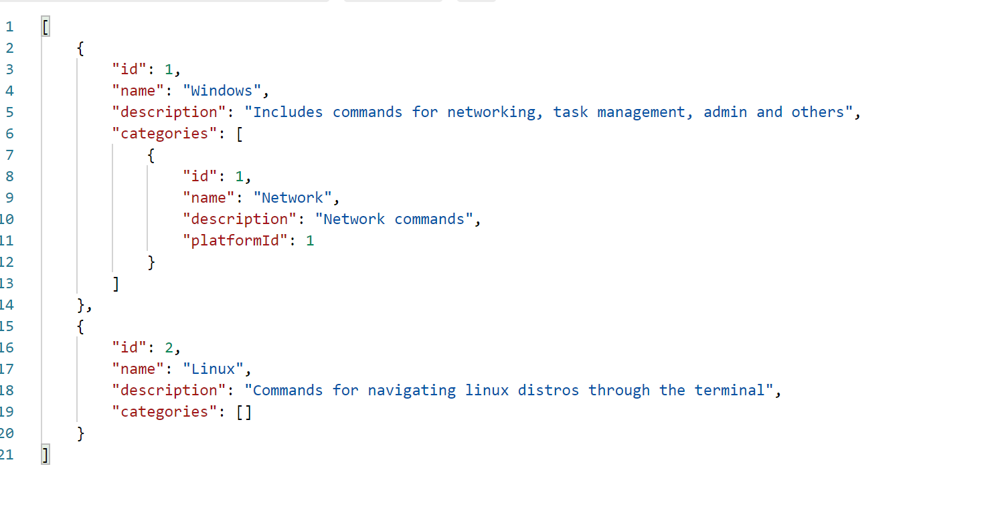
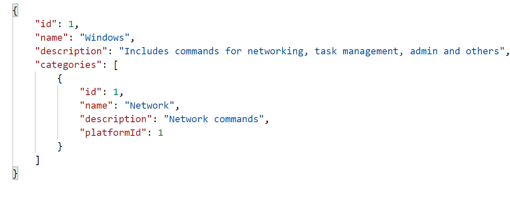
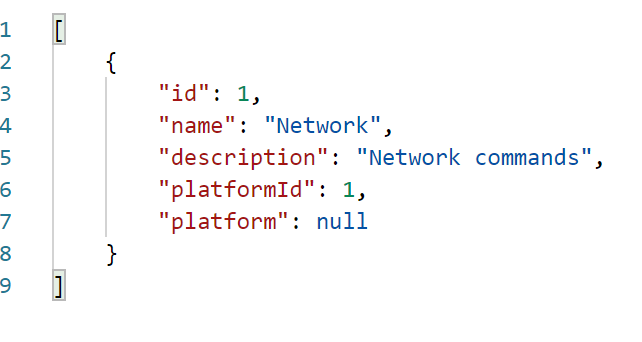
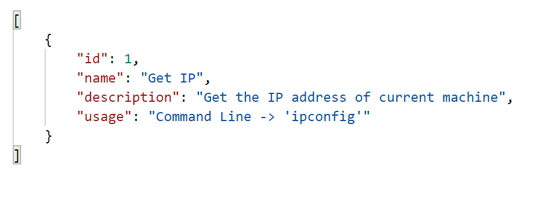

**Purpose**: Create a web API that allows users to query commands for various platforms, such as Windows powershell or Linux terminal.

**Created With**: C#, Entity Framework Core, .NET Core

**Github**: [Helpful Commands](https://github.com/adamlawson99/HelpfulCommands)

## About
The _Terminal Commands Utility_ project was created to solve the problem of forgetting useful commands for Windows and Linux. I found myself frequently forgetting important commands for tasks such as networking, admin, and navigation tasks. I wanted something that was easy to use and would also be platform independent so it could be accessed on Windows or Linux. I settled on a web API created in C# because it best fit what I wanted to accomplish and C# is my favorite language.

Entity Framework Core (EF Core) is the main driver behind this project functioning as an ORM, allowing us to take a code first approach to database development. EF Core allows us to work with database using traditional objects found in object oriented programming. For simple databases that must support CRUD operations it is the perfect choice as it allows simplicity while also being flexible enough to support more complex operations.


## Examples
All information for setting up the project can be found at the Github link listed above.

### List all platforms
```
https://localhost:44324/api/Platforms/
```

#### Select Platform
```
https://localhost:44324/api/Platforms/1
```

### List all Categories
```
https://localhost:44324/api/Categories/
```

#### Select Category
```
https://localhost:44324/api/Categories/1
```
### List all Commands
```
https://localhost:44324/api/Commands/
```

#### Select Command
```
https://localhost:44324/api/Commands/1
```


